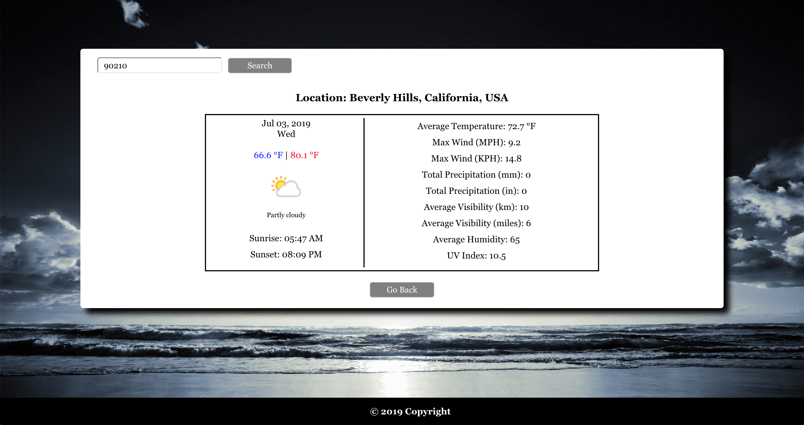

# Wea-App

## Description

A ReactJS application that lets users view a 5-day Forecast of a given location. Location can either be a US Zip Code or a City Name of any country 

Tools Used: **_ReactJS_**, **_EJS_**, **_NodeJS_**, **_CSS3_**

## Packages Used

Require - _https://www.npmjs.com/package/require_

Express - _https://www.npmjs.com/package/express_

Axios - _https://www.npmjs.com/package/axios_

Request - _https://www.npmjs.com/package/request_

## Folder Structure

	weather-app
		- client
		- node_modules (server side)
		- images (readme)
		- server

## Setting Up The Application

1. Downloading The App

2. Install The Packages Listed 

	- Using the _package.json_ file, run _"npm install"_ inside the weather-app folder (see Figure 1)
		- if _"npm audit fix"_ shows up, just run the command after the installation 	
	- The packages listed above should be inside _"node\_modules"_ folder to make the app work. Otherwise, you have to manually download the package (Use the link to see instruction)
	- For the React Part, go inside the client folder. Using the _package.json_ file, run _"yarn install"_ (see Figure 2)

<i>Figure 1: Package Installation (Server Side)</i>

<i>Figure 2: Package Installation (Client Side)</i>

3. Creating Your _.env_ file

	- This app is using _APIXU API_ for the weather information. To generate a key, click [here](https://www.apixu.com) to register. 
	- When you already have your key, create a _.env_ file inside your server folder and type in your key just like the one in the image below.
	

4. Running The App

	- Inside the server folder, type _"nodemon server.js"_ (see Figure 3)
	- Inside the client folder, type _"yarn start"_. You should see the following in Figure 4 when it run successfully. Also, the app will automatically open in the browser.

<i>Figure 3: Running The App (Server Side)</i>

<i>Figure 4: Running The App (Client Side)</i>

## Screenshots

1. Home Page

2. 5-Day Forecast Of A Given Zip Code

3. 5-Day Forecast Of A Given City

4. Detailed Info

5. No Matches

## Credits

Weather API - _https://www.apixu.com_

